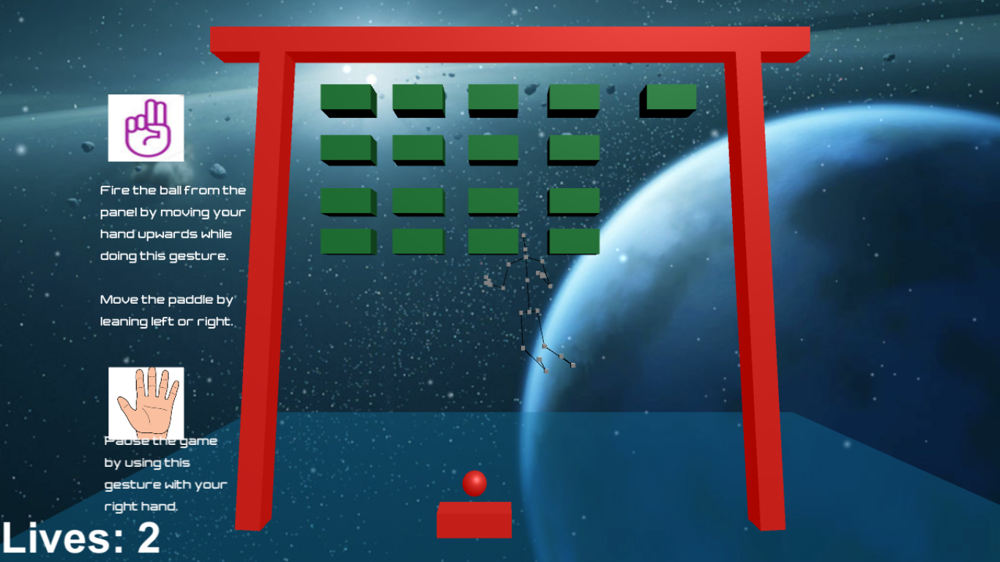

# GestureBasedUI

|  Name |      Jason McTigue | 
|----------|:-------------:|
| Id Number|  G00312233 |
| Subject |    Gesture Based UI   | 
| Lecturer | Damien Costello |
| Language/Software | Unity + Kinect v2 |

## Summary of project
This is a project I developed for my fouth year Gesture Based UI module. The aim of the project was to develop an application to demonstrate the use of gestures.

I decided to make a game similar to brick breaker and use gestures to make the paddle move either left or right depening on which direction the player is leaning and then another gesture for firing the ball.

## How to play
You will need to have the following to play:

* Kinect V2
* Kinect V2 adapter
* A laptop with a usb 3.0 port

Run the brickbreaker.exe file and then press play.

Stand infront of the screen until the kinect picks up your body. You will notice the skeleton appear in the backgroud.

Press start to begin the game.

Lean left or right to move the paddle and then raise your arm while doing the lasso gesture to fire the ball.

To pause the game open the palm of your right hand.
 
####  **Rules**

To win the game simply break all the blocks before you lose all your life's.